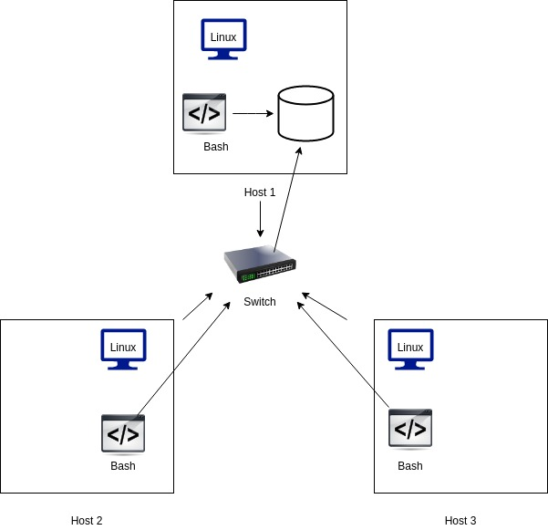

# Linux Cluster Monitoring Agent

The linux cluster monitoring agent is a tool that allow user to monitor nodes connected in a linux cluster by continuously keep track of the status of the system in use in real-time, in order to have the earliest warning of failures, defects or problems and to improve them. The collected data is stored in RDBMS database. This product is usefull in the job enviornment where too many nodes are connected with the switch and need to plan a future resource planning. 

The technologies used in project are :   
1. Bash
2. Git
3. PSQL
4. Docker

# Quick Start
- Start a psql instance using psql_docker.sh
````bash
./scripts/psql_docker.sh start
````
- Create tables using ddl.sql
````bash
./sql/ddl.sql 
````
- Insert hardware specs data into the db using host_info.sh
````bash
./scripts/host_info.sh psql_host psql_port db_name psql_user psql_password
````
- Insert hardware usage data into the db using host_usage.sh
````bash
starscripts/host_usage.sh psql_host psql_port db_name psql_user psql_passwordt
````
- Crontab setup
````bash
crontab -e
````

# Implemenation
A postgreSQL instance is provisioned by creating and starting a docker container. The program is implemented using linux command lines and scripts like host_info.sh and host_usage.sh are used to insert data and ddl.sql is used to create tables. At last, crontab is set up to monitor the usage for a specific time interval.

# Architecture

# Scripts
- psql_docker.sh:: 
This script creates psql instance with the given database name and password using docker and allows user to access it on the local machine.  
````bash
./scripts/psql_docker.sh start|stop|create (db_username)(db_password)
````  
- host_info.sh::
This script runs only once assuming hardware data is static and allows user to collect hardware specifications which is then inserted into the database table called host_info(psql instance)
````bash
./scripts/host_info.sh psql_host psql_port db_name psql_user psql_password
````  
- host_usage.sh::
This script collects the server usage data and is executed repeatedly in a specific interval of time and then stores data to psql database    
````bash
.scripts/host_usage.sh psql_host psql_port db_name psql_user psql_password
````
- crontab::
Crontab helps to execute the psql_usage.sh script every minute and collect the usage data. 

## Database Modeling
- `host_info`

Column|Type|Description
---|---|---
id|`SERIAL PRIMARY KEY`|Database ID
hostname|`VARCHAR UNIQUE`|Name of host
cpu_number|`INT`|Number of CPUs
cpu_architecture|`INT`|CPU architecture
cpu_model|`VARCHAR`|Name of CPU model
cpu_mhz|`INT`|Clock speed of CPU in MHz
L2_cache|`INT`|Size of L2 cache in kB
total_mem|`INT`|Total memory in kB
timestamp|`TIMESTAMP`|Time this data was collected

- `host_usage`

Column|Type|Description
---|---|---
timestamp|`TIMESTAMP`|Time this data was collected
host_id|`SERIAL`|ID of host in database
memory_free|`INT`|Amount of free memory in MB
cpu_idle|`INT`|% of time CPU spent idle
cpu_kernel|`INT`|% of time CPU spent used by kernel
disk_io|`INT`|Number of disk I/O
disk_available|`INT`|Amount of available disk space in MB
# Test 
- To test the scripts and sql queries, the first step is to connect the psql instance with the help of psqldocker.sh script and change the mode of each file to executable mode. ddl.sql file is executed to create the tables host_info and host_usage if does not exist. 
- host_info.sh and host_info.sh scripts are executed to retrieve the hardware information and resource usage information which is stored in a variable and then the data is inserted through psql CLI tool. 
- Crontab is set up to run the host_usage.sh script every minute to monitor the resource usage. 
- At last, sql queries are executed with the help of dbeaver GUI client to get the average memory usage in percentage for a fixed interval of time and hardware information grouped by cpu hosts.   

# Improvements
1. Create an automated script to connect to the psql instance 
2. Handle the hardware update and insert the new hardwware specifications into host_info 
3. Find a way to use windows function to group hosts by cpu number without use of aggregate functions
